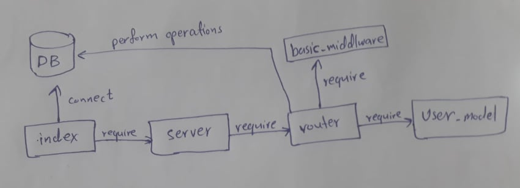

# auth-server# Business Requirements
Refer to the [Authentication System Overview](https://codefellows.github.io/code-401-javascript-guide/curriculum/apps-and-libraries/auth-server/) for a complete review of the application, including Business and Technical requirements along with the development roadmap.

## Phase 1 Requirements
Our business is expanding! We have a real need to manage a list of users of many types, and control their access to our data accordingly. The system to be built will have the following core features:

### Users can create an account, associated with a “role”
### User Roles will be pre-defined and will each have a list of allowed capabilities
#### admin can read, create, update, delete
#### editor can read, create, update
#### writer can read, create
#### user can read
### Users can then login with a valid username and password
### Alternatively, users can login using an OAuth provider such as Google or GitHub
#### In this case, users should be automatically assigned the role of user
### Once logged in, Users can then access any route on the server, so long as they are permitted by the capabilities that match their role.
#### For example, a route that deletes records should only work if your user role is “admin”

### Pahse 1 UML

