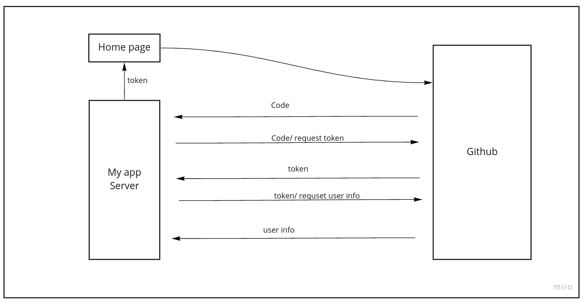
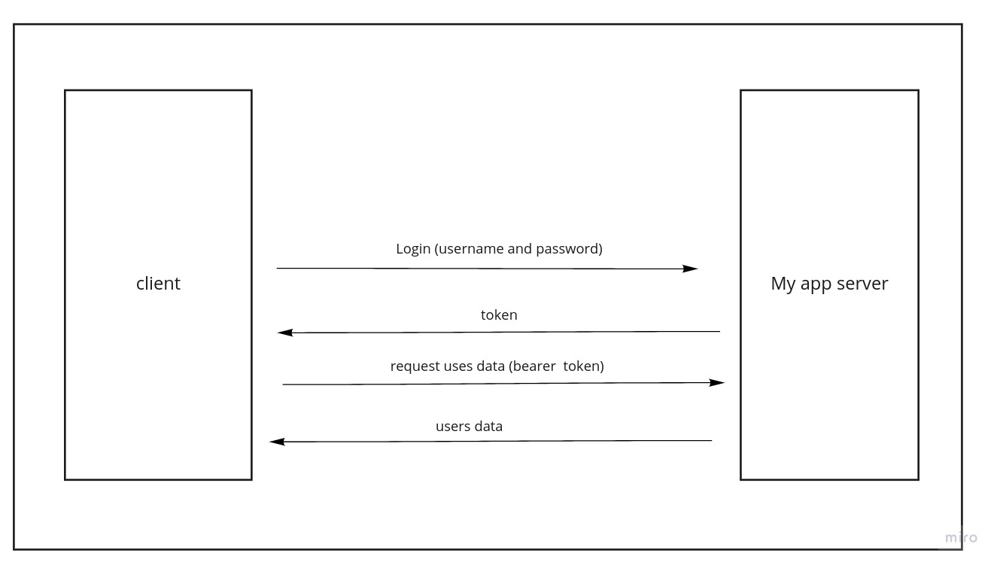

# Auth App
# Phase One
In this application we want to implement basic authentication using Node Express and MongoDB as a database.

## How to use the app
### Endpoints
### http://localhost:3000/signup
Use this endpoint with the method post to add new user to the application's database. Add username and password in the request's body.    
`Example: {"username":"ahmad","password":"ahmad123"}`

### http://localhost:3000/signin
Use this endpoint with the method post to sign in to the application with a valid uswer. Add username and password in the request's header in the basic authentication field.  

### Example:
`User Name:ahmad`
`Password:ahmad123`

### http://localhost:3000/users
Use this endpoint with the method get to get all users from application's database.

# Phase Two: Using Open Authentication
In this phase we will connect Github as a third party service provide to use user account in Github to login to our application.

## How to use the app
From home page click ob login. Github login windows will apear. Enter your username and password then ok. If you received a token this means operation succesful.

## Phase two UML

# Phase three: Using Bearer Authentication
In this phase we will use the token we recieved after we loggedin to authorize accessing routes instead of inserting username and password each time we click a route.

## How to use the app
The route http://localhost:3000/users now is available through bearer authentication. Make a requset to this route with the method post contianing the token in bearer auth field in the header, this will return users data from database.

## Phase three UML

